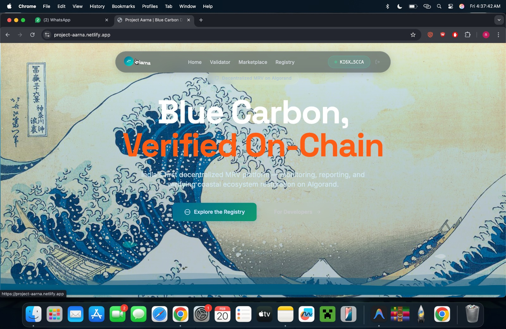

# Project Aarna

Decentralized MRV for India's Blue Carbon, built on Algorand.

RIFT 2026 Hackathon | PS4 — Carbon Credits & Sustainability

---

## The Problem

India has over 7,500 km of coastline. Mangroves, seagrasses, and wetlands along it — collectively known as blue carbon ecosystems — absorb 5 to 10 times more CO2 per hectare than terrestrial forests.

Despite this, there is no transparent system to monitor, report, or verify the impact of these ecosystems. The existing MRV pipeline is paper-based, centralized, and opaque. Communities restoring mangroves in the Sundarbans have no way to prove their carbon impact, receive verifiable credits, or trade them. Everything depends on trusting intermediaries.

Aarna was built to change that.

---

## What Aarna Does

Aarna is a Decentralized MRV (D-MRV) platform that takes a blue carbon project from submission to carbon credit issuance, entirely on-chain.

1. A developer (community, NGO, forest department) submits a blue carbon project along with IPFS evidence.
2. A validator (scientist, NCCR, expert body) reviews the submission and approves or rejects it on-chain.
3. On approval, AARNA tokens (Algorand Standard Assets) are minted and transferred as carbon credits.
4. Anyone can browse the public registry or trade credits on the marketplace.

Every step is recorded on the Algorand blockchain. Every status change, every credit issued, every transaction is fully auditable.

---

## Live Demo

**[project-aarna.netlify.app](https://project-aarna.netlify.app/)**

Connect Pera Wallet on Testnet to interact with the deployed contract.

Note: The validator wallet is preset. Judges and users can connect any Testnet wallet and submit a project as a developer. The contract supports a maximum of 4 project slots due to global state size constraints, so only one submission per evaluator is recommended.

---

## Testnet Deployments

Both deployments are live and verifiable on-chain.

**Current**

| | |
|---|---|
| App ID | [`755799555`](https://testnet.explorer.perawallet.app/application/755799555/) |
| AARNA ASA | [`755799568`](https://testnet.explorer.perawallet.app/asset/755799568/) |
| Network | Algorand Testnet via [AlgoNode](https://algonode.io/) |
| Validator | [`KI6X3F5...ENZUTA5CCA`](https://testnet.explorer.perawallet.app/address/KI6X3F5Y6CHH2MK4TA7RUVF43AXVGEAZN7TWT7BVNUU4JGQ5ENZUTA5CCA/) |

**Previous (has transaction history)**

| | |
|---|---|
| App ID | [`755793864`](https://testnet.explorer.perawallet.app/application/755793864/) |
| AARNA ASA | [`755793884`](https://testnet.explorer.perawallet.app/asset/755793884/) |

Verify on the [Algorand Testnet Explorer](https://testnet.explorer.perawallet.app/).

---

## Smart Contract

The core of Aarna is `AarnaRegistry`, a single ARC-4 smart contract written in Python using AlgoPy and compiled through the Puya compiler. It runs entirely on-chain with no off-chain dependencies for critical data.

The contract manages three roles — admin, validator, and developer — each enforced through on-chain assertions. The admin deploys the contract and assigns a validator. The validator reviews submitted projects and either approves or rejects them. On approval, the validator sets a credit amount and issues AARNA tokens directly to the submitter through an inner transaction.

AARNA is an Algorand Standard Asset created by the contract itself via `itxn.AssetConfig`. It has a total supply of 10 million, zero decimals, and is fully managed by the contract address (manager, reserve, clawback, freeze all point to the application). This means all token operations — issuance, escrow, clawback — are handled through inner transactions without any external custody.

Project data (name, location, ecosystem type, IPFS evidence CID, status, credit count, and submitter address) is stored directly in the contract's global state. The frontend reads this state to render dashboards and the registry. There is no off-chain database for project records.

The marketplace uses the same contract. A holder can list AARNA tokens for sale at a specified ALGO price. The contract escrows the tokens via clawback, and on purchase, it forwards the ALGO payment to the seller and releases the tokens to the buyer — all within inner transactions.

Status codes used in the contract: `0` = none, `1` = pending, `2` = verified, `3` = rejected, `4` = issued.

---

## Architecture

```
┌──────────────────────────────────────────────────────────────────┐
│                        Frontend (React + Vite)                   │
│                                                                  │
│  ┌──────────┐ ┌───────────┐ ┌──────────┐ ┌────────┐ ┌────────┐ │
│  │ Landing  │ │ Developer │ │ Validator│ │Registry│ │Market- │ │
│  │  Page    │ │ Dashboard │ │Dashboard │ │  Page  │ │ place  │ │
│  └──────────┘ └─────┬─────┘ └────┬─────┘ └───┬────┘ └───┬────┘ │
│                     │            │            │          │       │
│              ┌──────┴────────────┴────────────┴──────────┴──┐   │
│              │          useAarna.ts (React Hook)            │   │
│              │   deploy · submit · approve · reject · issue │   │
│              │   listForSale · buy · cancel · optIn         │   │
│              └──────────────────┬────────────────────────────┘   │
│                                 │                                │
│              ┌──────────────────┴───────────────────┐            │
│              │  @txnlab/use-wallet-react            │            │
│              │  Pera Wallet · Defly · Exodus        │            │
│              └──────────────────┬───────────────────┘            │
└─────────────────────────────────┼────────────────────────────────┘
                                  │ ARC-4 ABI calls
                                  ▼
┌──────────────────────────────────────────────────────────────────┐
│               AarnaRegistry — Algorand Smart Contract            │
│               (AlgoPy / Puya Compiler → ARC-4 ABI)              │
│                                                                  │
│  Roles:    admin ──► deploys, creates ASA, sets validator        │
│            validator ──► approves/rejects, issues credits        │
│            developer ──► submits projects                        │
│            any holder ──► lists/buys credits                     │
│                                                                  │
│  State:    4 project slots (name, location, ecosystem,           │
│            CID, status, credits, submitter)                      │
│            4 marketplace listing slots                           │
│            AARNA ASA (10M total supply)                          │
│                                                                  │
│  Inner     AssetConfig  → create AARNA token                    │
│  Txns:     AssetTransfer → issue credits to submitter            │
│            AssetTransfer → escrow/release on marketplace         │
│            Payment       → forward ALGO to seller on buy         │
└──────────────────────────────────────────────────────────────────┘
                                  │
                                  ▼
                    ┌─────────────────────────┐
                    │   Algorand Testnet      │
                    │   via AlgoNode RPCs     │
                    │   (algod + indexer)     │
                    └─────────────────────────┘

                    ┌─────────────────────────┐
                    │   IPFS                  │
                    │   Evidence stored as    │
                    │   CID references        │
                    └─────────────────────────┘
```

---

## Screenshots

### Landing Page


### Developer Dashboard


### Public Registry


### Wallet — AARNA Credits Received


---

## Algorand Integration

Every meaningful action in Aarna touches the chain. This is not a wrapper around a database.

**Smart Contract**

The `AarnaRegistry` contract is a single ARC-4 application written in Python using AlgoPy/Puya. It handles the full project lifecycle:

- `init()` — deploys the contract, sets the deployer as admin
- `set_validator(addr)` — admin assigns a validator, enforced via `assert`
- `submit_project(name, location, ecosystem, cid)` — anyone can submit, status starts as pending
- `approve_project(id, credits)` / `reject_project(id)` — validator-only
- `issue_credits(id)` — inner transaction (`itxn.AssetTransfer`) sends AARNA tokens to the submitter
- `list_for_sale(amount, price)` / `buy_listing(id, payment)` — marketplace with escrow via clawback

**AARNA Token**

Created via `itxn.AssetConfig` inside `ensure_token()`. 10 million supply, zero decimals, managed and clawed back by the contract address. This is a native Algorand Standard Asset, not a wrapped token.

**Inner Transactions**

The contract issues 4 types:
- `AssetConfig` — create the AARNA ASA
- `AssetTransfer` — issue credits, handle marketplace escrow
- `AssetTransfer` (with `asset_sender`) — clawback during listing
- `Payment` — forward ALGO from buyer to seller

**On-chain State**

All project data (name, location, ecosystem, IPFS CID, status, credits, submitter address) lives in global state. The frontend reads it directly. No off-chain database is required for core data.

---

## Project Lifecycle

```
     Developer              Validator               Blockchain
         │                      │                        │
         │  submit_project()    │                        │
         │─────────────────────►│                        │
         │                      │   status = PENDING     │
         │                      │───────────────────────►│
         │                      │                        │
         │                      │  approve_project()     │
         │                      │───────────────────────►│
         │                      │   status = VERIFIED    │
         │                      │                        │
         │                      │  issue_credits()       │
         │                      │───────────────────────►│
         │  ◄── AARNA tokens ──────── inner txn ────────│
         │                      │   status = ISSUED      │
         │                      │                        │
```

Status codes: `0` = none, `1` = pending, `2` = verified, `3` = rejected, `4` = issued.

---

## Tech Stack

| Layer | Technology |
|---|---|
| Blockchain | Algorand Testnet |
| Smart Contract | AlgoPy, compiled via Puya |
| Carbon Credit Token | AARNA ASA |
| Frontend | React 18, TypeScript, Vite |
| Styling | TailwindCSS, daisyUI |
| Wallet | Pera, Defly, Exodus via `@txnlab/use-wallet-react` |
| Evidence | IPFS (CID references on-chain) |
| Nodes | AlgoNode (algod + indexer) |
| Tooling | AlgoKit CLI |

---

## Folder Structure

```
project-aarna/
├── projects/
│   ├── project-aarna-contracts/
│   │   └── smart_contracts/
│   │       └── aarna_registry/
│   │           └── contract.py
│   │       └── artifacts/
│   │
│   └── project-aarna-frontend/
│       ├── src/
│       │   ├── pages/
│       │   │   ├── Landing.tsx
│       │   │   ├── Developer.tsx
│       │   │   ├── Validator.tsx
│       │   │   ├── Registry.tsx
│       │   │   └── Marketplace.tsx
│       │   ├── hooks/
│       │   │   └── useAarna.ts
│       │   ├── context/
│       │   │   └── AarnaContext.tsx
│       │   ├── contracts/
│       │   │   └── AarnaRegistry.ts
│       │   ├── constants/
│       │   │   └── roles.ts
│       │   └── data/
│       │       └── mockProjects.ts
│       └── .env
└── README.md
```

---

## Team BRO CODE

| Member |
|---|
| Vishnu K |
| Siddharth P |
| Revanth M |
| P Yukthesh |

RIFT 2026 | PS4 Algorand — Carbon Credits & Sustainability
